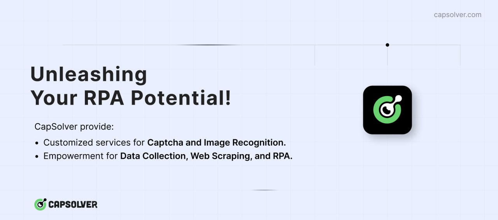

# python3-anticaptcha


### [Capsolver](https://capsolver.com?utm_source=github&utm_medium=banner_github&utm_campaign=python3-anticaptcha)

[](https://capsolver.com?utm_source=github&utm_medium=banner_github&utm_campaign=python3-anticaptcha)

[Capsolver.com](https://www.capsolver.com/?utm_source=github&utm_medium=banner_github&utm_campaign=python3-anticaptcha) is an AI-powered service that specializes in solving various types of captchas automatically. It supports captchas such as [reCAPTCHA V2](https://docs.capsolver.com/guide/captcha/ReCaptchaV2.html?utm_source=github&utm_medium=banner_github&utm_campaign=python3-anticaptcha), [reCAPTCHA V3](https://docs.capsolver.com/guide/captcha/ReCaptchaV3.html?utm_source=github&utm_medium=banner_github&utm_campaign=python3-anticaptcha), [hCaptcha](https://docs.capsolver.com/guide/captcha/HCaptcha.html?utm_source=github&utm_medium=banner_github&utm_campaign=python3-anticaptcha), [FunCaptcha](https://docs.capsolver.com/guide/captcha/FunCaptcha.html?utm_source=github&utm_medium=banner_github&utm_campaign=python3-anticaptcha), [DataDome](https://docs.capsolver.com/guide/captcha/DataDome.html?utm_source=github&utm_medium=banner_github&utm_campaign=python3-anticaptcha), [AWS Captcha](https://docs.capsolver.com/guide/captcha/awsWaf.html?utm_source=github&utm_medium=banner_github&utm_campaign=python3-anticaptcha), [Geetest](https://docs.capsolver.com/guide/captcha/Geetest.html?utm_source=github&utm_medium=banner_github&utm_campaign=python3-anticaptcha), and Cloudflare [Captcha](https://docs.capsolver.com/guide/antibots/cloudflare_turnstile.html?utm_source=github&utm_medium=banner_github&utm_campaign=python3-anticaptcha) / [Challenge 5s](https://docs.capsolver.com/guide/antibots/cloudflare_challenge.html?utm_source=github&utm_medium=banner_github&utm_campaign=python3-anticaptcha), [Imperva / Incapsula](https://docs.capsolver.com/guide/antibots/imperva.html?utm_source=github&utm_medium=banner_github&utm_campaign=python3-anticaptcha), among others.

For developers, Capsolver offers API integration options detailed in their [documentation](https://docs.capsolver.com/?utm_source=github&utm_medium=banner_github&utm_campaign=python3-anticaptcha), facilitating the integration of captcha solving into applications. They also provide browser extensions for [Chrome](https://chromewebstore.google.com/detail/captcha-solver-auto-captc/pgojnojmmhpofjgdmaebadhbocahppod) and [Firefox](https://addons.mozilla.org/es/firefox/addon/capsolver-captcha-solver/), making it easy to use their service directly within a browser. Different pricing packages are available to accommodate varying needs, ensuring flexibility for users.

<hr>

[](https://badge.fury.io/py/python3-anticaptcha)
[](https://badge.fury.io/py/python3-anticaptcha)
[](https://pepy.tech/project/python3-anticaptcha)

[](https://codeclimate.com/github/AndreiDrang/python3-anticaptcha)
[](https://www.codacy.com/gh/AndreiDrang/python3-anticaptcha/dashboard?utm_source=github.com&amp;utm_medium=referral&amp;utm_content=AndreiDrang/python3-anticaptcha&amp;utm_campaign=Badge_Grade)
[](https://codecov.io/gh/AndreiDrang/python3-anticaptcha)

[](https://github.com/AndreiDrang/python3-anticaptcha/actions/workflows/sphinx.yml)
[](https://github.com/AndreiDrang/python3-anticaptcha/actions/workflows/test_build.yml)
[](https://github.com/AndreiDrang/python3-anticaptcha/actions/workflows/install.yml)
[](https://github.com/AndreiDrang/python3-anticaptcha/actions/workflows/test.yml)
[](https://github.com/AndreiDrang/python3-anticaptcha/actions/workflows/lint.yml)


Python 3 library for [AntiCaptcha](https://anti-captcha.com/) service API.

Tested on UNIX based OS.

The library is intended for software developers and is used to work with the [AntiCaptcha](https://anti-captcha.com/) service API.

***

If you have any questions, please send a message to the [Telegram](https://t.me/pythoncaptcha) chat room.

Or email python-captcha@pm.me

## How to install?

We recommend using the latest version of Python. `python3-anticaptcha` supports Python 3.7+.

### pip

```bash
pip install python3-anticaptcha
```


## How to test?

1. You need set ``API_KEY`` in your environment(get this value from you account).
2. Run command ``make tests``, from root directory.

### Additional info
1. [Library usage examples && Docs](https://andreidrang.github.io/python3-anticaptcha/)
2. [AntiCaptcha errors list](https://anti-captcha.com/apidoc/errors)


### How to get API Key to work with the library
1. On the page - https://anti-captcha.com/clients/settings/apisetup
2. Find it: 
