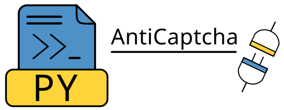
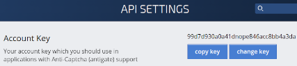

# python3-anticaptcha

Python 3 library for [AntiCaptcha](https://anti-captcha.com/) service API.

Tested on UNIX based OS.

The library is intended for software developers and is used to work with the [AntiCaptcha](https://anti-captcha.com/) service API.

***

If you have any questions, please send a message to the [Telegram](https://t.me/pythoncaptcha) chat room.

Or email python-captcha@pm.me

***

### Additional info
1. [Library usage examples && Docs](https://andreidrang.github.io/python3-anticaptcha/)
2. [AntiCaptcha errors list](https://anti-captcha.com/apidoc/errors)

### Get API Key to work with the library
1. On the page - https://anti-captcha.com/clients/settings/apisetup
2. Find it: 
