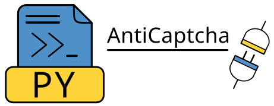

# Introduction

## Welcome to python3-anticaptcha



<a href="https://dashboard.capsolver.com/passport/register?inviteCode=kQTn-tG07Jb1">
    
</a>
<br>
At the lowest price on the market, you may receive a variety of solutions, including reCAPTCHA V2, reCAPTCHA V3, hCaptcha, hCaptcha Click, FunCaptcha, picture-to-text, and more. With this service, 0.1s is the slowest speed ever measured.
<hr>

[](https://badge.fury.io/py/python3-anticaptcha)
[](https://badge.fury.io/py/python3-anticaptcha)
[](https://pepy.tech/project/python3-anticaptcha)

[](https://codeclimate.com/github/AndreiDrang/python3-anticaptcha)
[](https://www.codacy.com/gh/AndreiDrang/python3-anticaptcha/dashboard?utm_source=github.com&amp;utm_medium=referral&amp;utm_content=AndreiDrang/python3-anticaptcha&amp;utm_campaign=Badge_Grade)
[](https://codecov.io/gh/AndreiDrang/python3-anticaptcha)

[](https://github.com/AndreiDrang/python3-anticaptcha/actions/workflows/test_build.yml)
[](https://github.com/AndreiDrang/python3-anticaptcha/actions/workflows/install.yml)
[](https://github.com/AndreiDrang/python3-anticaptcha/actions/workflows/test.yml)
[](https://github.com/AndreiDrang/python3-anticaptcha/actions/workflows/lint.yml)


Python 3 library for [AntiCaptcha](https://anti-captcha.com/) service API.

Tested on UNIX based OS.

The library is intended for software developers and is used to work with the [AntiCaptcha](https://anti-captcha.com/) service API.

## How to install?

We recommend using the latest version of Python. `python3-anticaptcha` supports Python 3.7+.

### pip

```bash
pip install python3-anticaptcha
```

### Source
```bash
git clone https://github.com/AndreiDrang/python3-anticaptcha.git
cd python3-anticaptcha
python setup.py install
```

## How to test?

1. You need set ``API_KEY`` in your environment(get this value from you account).
2. Run command ``make tests``, from root directory.
